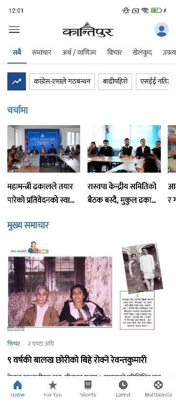

# Ekantipur Clone

Ekantipur Clone
Welcome to the Ekantipur Clone Flutter project! This project replicates the functionalities and design of the Ekantipur news app.

,
,
,
,
,
,
,
,

## Getting Started

This guide will help you set up and run your Flutter application.

Resources for Beginners
If this is your first time working with Flutter, here are some resources to get you started:

- [Lab: Write your first Flutter app](https://docs.flutter.dev/get-started/codelab)
- [Cookbook: Useful Flutter samples](https://docs.flutter.dev/cookbook),

# How to Run
To run this application, follow these steps:

1. Clone the repository:
[online documentation](git clone https://github.com/yourusername/ekantipur_clone.git), cd ekantipur_clone,

# Features
1. You can simply copy my code for your app ui.

# License
This project is licensed under the MIT License. See the LICENSE file for details.

# Contact
If you have any questions or suggestions, feel free to open an issue or contact us at rojanparajuli13@example.com.

